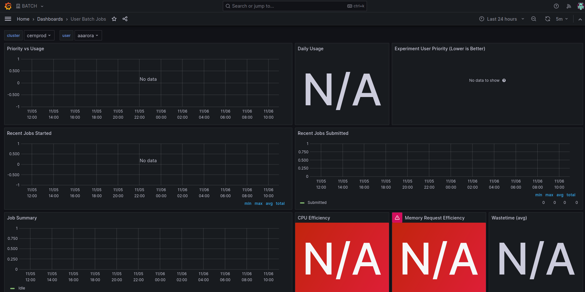

# Cern Utils

## Account

* Configuration and [Resources Portal](https://resources.web.cern.ch/resources/). You may need to upgrade you account as follows:
    1. List Services > E-Groups -> register with you CERN account and search for _np-comp: Linux group np-comp - Neutrino Platform_ and _np04-t0comp-users: Tier0 cores for NP04 users_.
    2. Once this is approved you can check your subscriptions at List Services > LXPLUS and Linux > Computing Groups.
    3. List Services > AFS Workspaces > Settings -> Increase your home folder and workspace to 10GB and 100GB respectively.

If you configured your account you should have an `/afs/cern.ch/work/U/USER_NAME/` existing folder. To monitor your jobs you can enter in:
* [Grafana](https://monit-grafana.cern.ch/dashboards). You need to change  your organization to *BATCH* in your Profile and in Dashboards > User Batch Jobs -> cluster: cernprod and user: USER_NAME you can check your jobs.


## Computing

### Connect to lxplus

* Connect to CERN computers: `ssh -C -D 10080 USUARIOCERN@lxplus.cern.ch`. Check [here](https://indico.cern.ch/event/1206471/contributions/5157610/attachments/2555218/4403029/Bash-Python%20Intro%20Starterkit%202022.pdf) for more information.

### Using Apptainer at lxplus machines

[link](https://awesome-workshop.github.io/docker-singularity-hats/09-apptainer/index.html)

### Additional resources

* [CERN Box](https://auth.cern.ch/auth/realms/cern/protocol/openid-connect/auth?client_id=cernbox-service&redirect_uri=https%3A%2F%2Fcernbox.cern.ch%2Foidc-callback.html&response_type=code&scope=openid+profile+email&state=4ad736181b2e46d0ad608b9a36a73f63&code_challenge=paEeVlNmOzgajMrzI_11RL8JSDEgzMEYGQCddJrkIBk&code_challenge_method=S256&response_mode=query)
* [CERN Mail](https://auth.cern.ch/auth/realms/cern/protocol/openid-connect/auth?response_type=code&scope=openid%20email&client_id=webframeworks-webeos-mailservices-docs&state=6WbPMjWuR60rE3OXc_dDVlFQFKU&redirect_uri=https%3A%2F%2Fmailservices.docs.cern.ch%2Foidc%2Fcallback&nonce=pYiBM92zHoLiAAce3CX4vhPCJmvwMjFo5-5Ov0-NJm8)
* [Neutrino Platform Twiki](https://twiki.cern.ch/twiki/bin/view/CENF/CENFStorageAtCERN#How_to_access_Neutrino_Platform)

* You may need to use an specific python/ROOT version and to use them a virtual or conda enviroment are recommended. Check [here](https://abpcomputing.web.cern.ch/guides/python_inst/) for more.
```bash
wget https://github.com/conda-forge/miniforge/releases/latest/download/Miniforge3-Linux-x86_64.sh
bash Miniforge3-latest-Linux-x86_64.sh

conda create -n <your_env_name> python=3.6
conda activate <your_env_name>
#conda install -c conda-forge mamba
mamba install root
[OPTIONAL] pip install -r scripts/requirements.txt
```
This is checked to work until python 3.10 and ROOT 6.28.00. (you can import ROOT from python and jupyter notebooks but root_numpy does not work)
